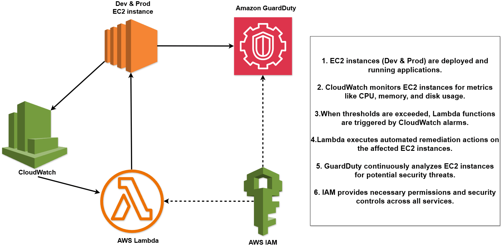

# aws-monitoring-auto-remediation-lab
AWS monitoring and auto-remediation system using CloudWatch, Lambda, and GuardDuty to detect, respond to, and mitigate performance and security issues across cloud environments.

## 3.1 Project Overview

### Overview

#### Scenario
CloudGuard, a financial services company, recently experienced a security breach due to delayed detection of unusual system behavior. The operations team identified the issue too late, resulting in significant downtime and potential data exposure.

In response, leadership has prioritized building a proactive monitoring and automated remediation system to prevent similar incidents in the future.

---

### Solution

This project implements a comprehensive monitoring and auto-remediation system using:

- Amazon CloudWatch for real-time monitoring and alerting  
- AWS Lambda for automated remediation  
- Amazon GuardDuty for intelligent threat detection  

The system is designed to automatically detect and respond to both performance issues and security threats across development and production environments.

---

### Project Description

In this project, I will take on the role of a **Cloud Support Engineer**.

I will:
- Configure monitoring for EC2 instances  
- Trigger automated responses to performance issues  
- Detect and investigate security threats  
- Simulate real-world incidents and respond accordingly  

---

### Project Steps

The project is divided into the following key phases:

1. Configure EC2 environments (Development and Production)  
2. Implement custom CloudWatch monitoring  
3. Create automated remediation using AWS Lambda  
4. Enable GuardDuty and perform security incident response  

---

### Services Used

- **Amazon EC2** – Virtual servers for dev and prod environments  
- **Amazon CloudWatch** – Monitoring, metrics, alarms, and alerting  
- **AWS Lambda** – Serverless automation for remediation  
- **Amazon GuardDuty** – Threat detection and security monitoring  
- **AWS IAM** – Identity and access management  

---

### Architecture Diagram

---

### Final Outcome

By completing this project, you will build a fully functional monitoring and auto-remediation system for CloudGuard that demonstrates:

- Real-time detection of performance issues using CloudWatch  
- Automated remediation using Lambda functions  
- Threat detection with GuardDuty  
- Practical incident response workflows  

This project provides hands-on experience with AWS monitoring and security services, helping you develop real-world skills expected from cloud support and security professionals.
