# aws-monitoring-auto-remediation-lab
AWS monitoring and auto-remediation system using CloudWatch, Lambda, and GuardDuty to detect, respond to, and mitigate performance and security issues across cloud environments.

## 3.1 Project Overview

### Overview:

#### Scenario
CloudGuard, a financial services company, recently experienced a security breach due to delayed detection of unusual system behavior. The operations team identified the issue too late, resulting in significant downtime and potential data exposure.

In response, leadership has prioritized building a proactive monitoring and automated remediation system to prevent similar incidents in the future.

---

### Solution:
This project implements a comprehensive monitoring and auto-remediation system using:
- Amazon CloudWatch for real-time monitoring and alerting  
- AWS Lambda for automated remediation  
- Amazon GuardDuty for intelligent threat detection  

The system is designed to automatically detect and respond to both performance issues and security threats across development and production environments.

---

### Project Description
In this project, I will take on the role of a **Cloud Support Engineer**.
I will:
- Configure monitoring for EC2 instances  
- Trigger automated responses to performance issues  
- Detect and investigate security threats  
- Simulate real-world incidents and respond accordingly  

---

### Project Steps:
The project is divided into the following key phases:
1. Configure EC2 environments (Development and Production)  
2. Implement custom CloudWatch monitoring  
3. Create automated remediation using AWS Lambda  
4. Enable GuardDuty and perform security incident response  

---

### Services Used
- **Amazon EC2** – Virtual servers for dev and prod environments  
- **Amazon CloudWatch** – Monitoring, metrics, alarms, and alerting  
- **AWS Lambda** – Serverless automation for remediation  
- **Amazon GuardDuty** – Threat detection and security monitoring  
- **AWS IAM** – Identity and access management  

---
## Final Result

A fully functional AWS monitoring and auto-remediation system for CloudGuard that demonstrates:

- Real-time performance monitoring using Amazon CloudWatch  
- Automated remediation workflows using AWS Lambda  
- Threat detection and security monitoring with Amazon GuardDuty  
- Incident response procedures for cloud support operations  
- Infrastructure monitoring across development and production environments  

This project provides hands-on experience with AWS monitoring, cloud security, and automated response systems used in real-world cloud environments.

### Final Architecture Diagram 


# 3.2 Launching and Configuring EC2 Instances

## Introduction

In this phase of the project, I created separate EC2 environments to simulate real-world development and production infrastructure.

Creating multiple environments allows organizations to apply different monitoring configurations, security controls, and troubleshooting procedures while safely testing cloud operations.

---

## Launching EC2 Instances

### Development Server Configuration

Created the first EC2 instance to represent a development environment.

#### Configuration
- Name: `Dev-Server`
- Environment Tag: `Dev`
- AMI: Amazon Linux 2023
- Instance Type: `t2.micro`
- Storage: `8 GB gp3`
- Security Group: Allow SSH from my IP

### Screenshot
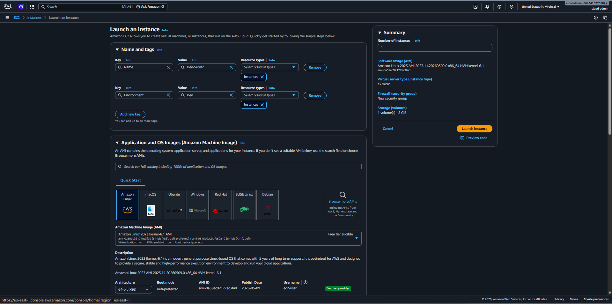

---

### Production Server Configuration

Created the second EC2 instance to represent a production environment.

#### Configuration
- Name: `Prod-Server`
- Environment Tag: `Production`
- AMI: Amazon Linux 2023
- Instance Type: `t2.micro`
- Storage: `8 GB gp3`
- Security Group: Allow SSH from my IP

### Screenshot
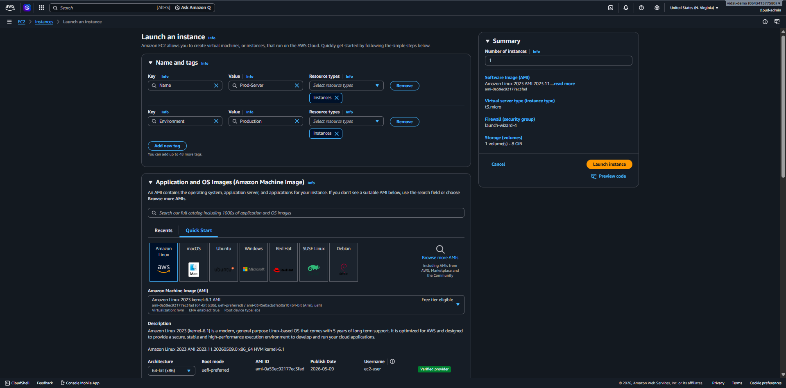

---

## Verifying Instance Deployment

After launching both instances, I verified they successfully entered the `Running` state in the EC2 dashboard.

### Screenshot
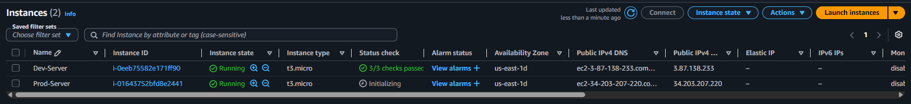

---

# Instance Configuration for Monitoring & Troubleshooting

To simulate real-world operational issues, I installed testing utilities on both EC2 instances.

These tools will be used later to:
- Trigger CloudWatch alarms
- Simulate performance issues
- Test automated remediation workflows
- Validate monitoring configurations

---

## Development Environment Setup

### Installing the `stress` Tool

Installed the `stress` package on the development server to simulate high CPU utilization events.

### Command Used

```bash
sudo yum install stress -y
```

### Screenshot
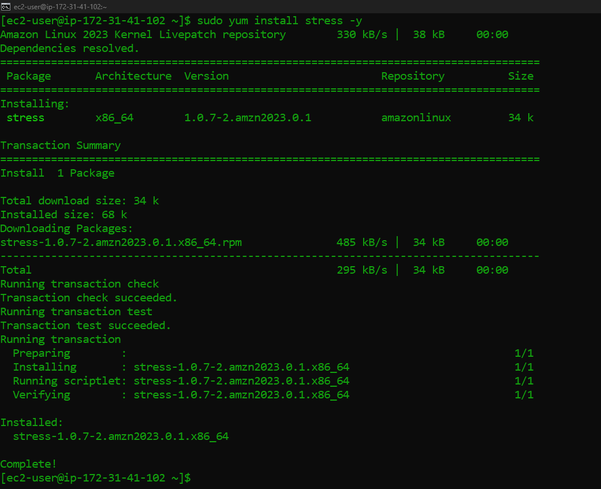

---

### Simulating High CPU Usage

The `stress` tool generates artificial CPU load to trigger CloudWatch alarms and test monitoring workflows.

### Command Used

```bash
sudo stress --cpu 8 --timeout 300
```

### Screenshot
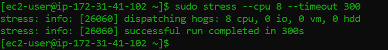

### CloudWatch Metrics

The CPU stress test successfully generated increased CPU utilization and network activity within Amazon CloudWatch metrics.

### Screenshot
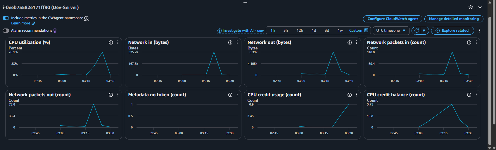

---

## Production Environment Setup

### Installing `util-linux`

Installed the `util-linux` package on the production server to simulate disk usage issues.

### Command Used

```bash
sudo yum install util-linux -y
```

### Screenshot
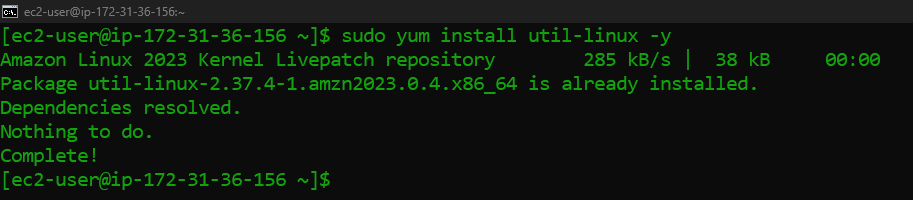

---

### Simulating Disk Space Issues

Used the `fallocate` command to quickly allocate storage space and trigger disk monitoring alerts.

### Command Used

```bash
fallocate -l 6G /home/ec2-user/fakefile
```

### Screenshot
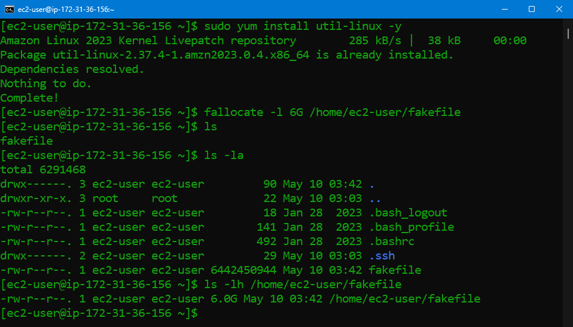

### Verifying Disk Usage

Verified the disk utilization increased successfully after creating the test file.

### Command Used

```bash
df -h
```

### Screenshot
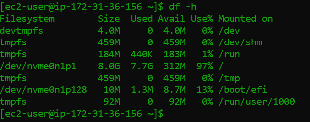

---

## Cleanup

Removed the test file to restore available disk space after testing.

### Command Used

```bash
rm /home/ec2-user/fakefile
```

### Screenshot
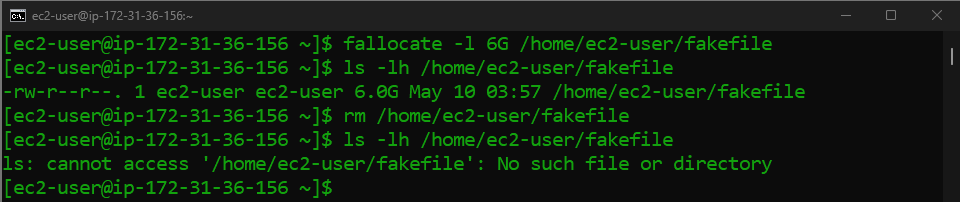

### Verifying Available Disk Space

Verified that disk utilization returned to normal after removing the test file.

### Command Used

```bash
df -h
```

### Screenshot
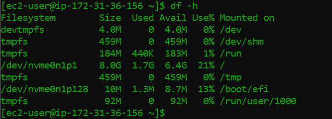

The available disk space increased successfully after cleanup, confirming the simulated storage issue was resolved.

---

## Safety Considerations & Summary

The testing tools used throughout this project provide a safe and controlled way to simulate real-world cloud infrastructure issues without causing permanent system damage.

### Key Safety Features
- CPU stress testing automatically stops after the configured timeout period  
- Disk space can be restored immediately by removing the test file  
- No permanent changes were made to the EC2 instances  
- Simulated incidents were designed to avoid service disruption  

These controlled simulations allowed me to safely verify:
- CloudWatch monitoring functionality  
- System performance visibility  
- Infrastructure troubleshooting procedures  
- Readiness for automated remediation workflows  

---

## Outcome

Successfully configured:
- Development and production EC2 environments  
- CPU stress testing for monitoring validation  
- Disk usage simulation for alert testing  
- Infrastructure preparation for CloudWatch monitoring and automated remediation  

This phase established the foundation for implementing real-time monitoring, alerting, and automated incident response within AWS cloud environments.

---

# 3.3 Install CloudWatch Agent for Custom Metrics

## Introduction

In this phase of the project, I installed and configured the Amazon CloudWatch Agent on both EC2 instances to collect additional system metrics beyond the default EC2 monitoring data.

By default, CloudWatch provides limited metrics such as CPU utilization. Installing the CloudWatch Agent allows monitoring of:
- Memory utilization
- Disk usage
- Network performance
- System-level operational metrics

This provides improved visibility into infrastructure health and performance across both development and production environments.

---

## Installing the CloudWatch Agent

Connected to the `Dev-Server` instance and installed the Amazon CloudWatch Agent package.

### Command Used

```bash
sudo yum install amazon-cloudwatch-agent -y
```

### Screenshot
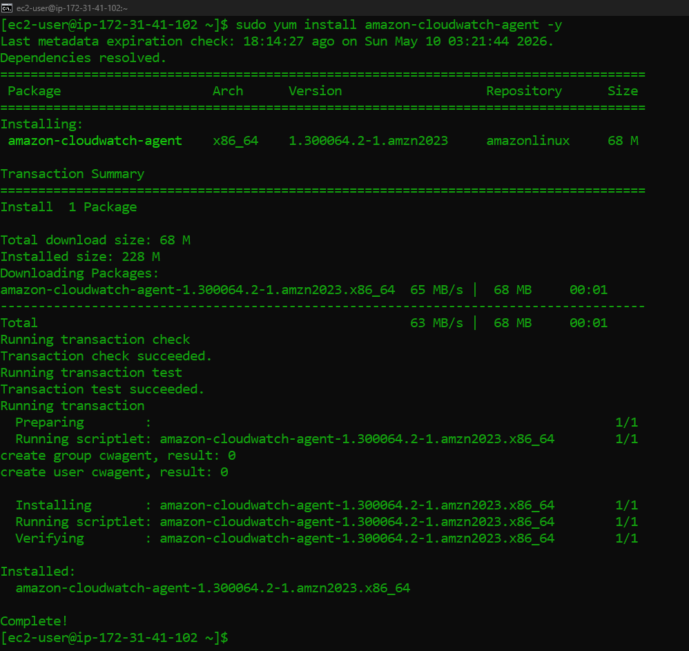

---

## Running the CloudWatch Agent Configuration Wizard

Configured the CloudWatch Agent using the interactive configuration wizard.

### Command Used

```bash
sudo /opt/aws/amazon-cloudwatch-agent/bin/amazon-cloudwatch-agent-config-wizard
```

### Configuration Summary

| Configuration | Selection |
|---|---|
| Operating System | Linux |
| Environment | EC2 |
| Agent User | root |
| StatsD | No |
| CollectD | No |
| Host Metrics | Yes |
| Per-Core CPU Metrics | No |
| EC2 Dimensions | Yes |
| Aggregate EC2 Metrics | No |
| Collection Interval | 60 Seconds |
| Metrics Configuration | Standard |
| Log Monitoring | No |
| X-Ray Tracing | No |
| Store in Parameter Store | No |

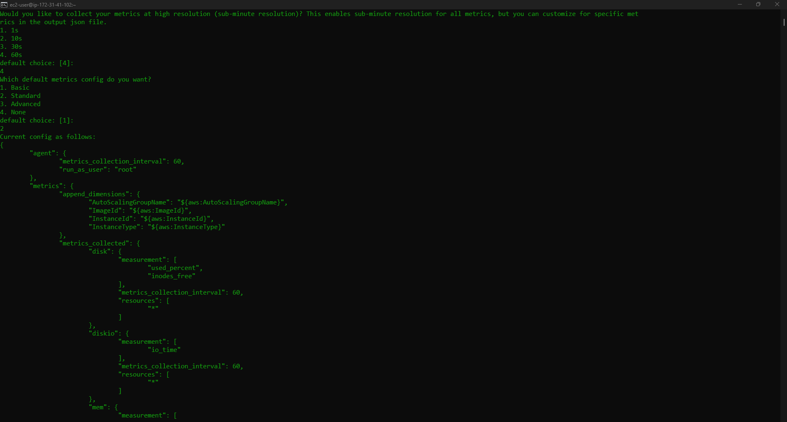

---

## Starting the CloudWatch Agent

After completing the configuration wizard, I started the CloudWatch Agent using the generated configuration file.

### Command Used

```bash
sudo /opt/aws/amazon-cloudwatch-agent/bin/amazon-cloudwatch-agent-ctl \
-a fetch-config \
-m ec2 \
-c file:/opt/aws/amazon-cloudwatch-agent/bin/config.json \
-s
```

### Screenshot
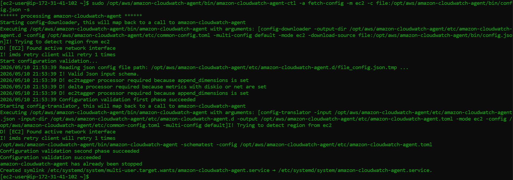

---

## Verifying Agent Status

Verified the CloudWatch Agent was running successfully on the EC2 instance.

### Command Used

```bash
sudo systemctl status amazon-cloudwatch-agent
```

### Screenshot
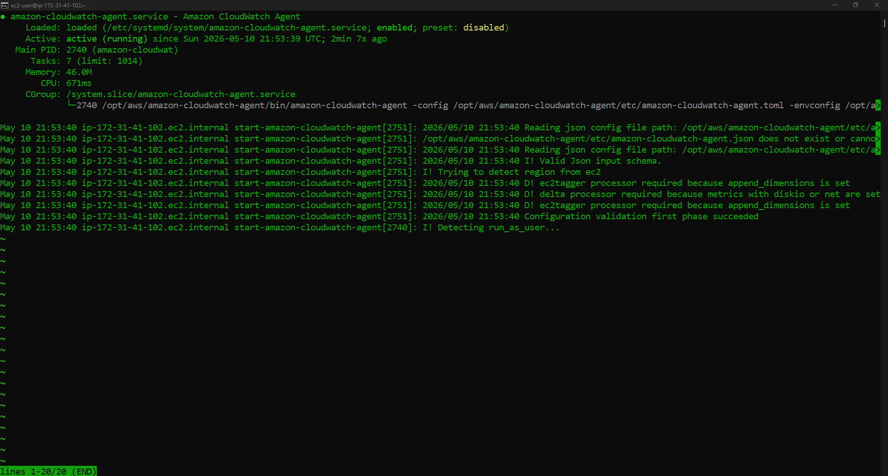

Expected output:

```bash
active (running)
```

This confirms the CloudWatch Agent is actively collecting and sending metrics to Amazon CloudWatch.

---

## Repeating Configuration for Production Environment

Repeated the CloudWatch Agent installation and configuration process on the `Prod-Server` instance to ensure monitoring coverage across both environments.

Why both environments?
- Improved infrastructure visibility
- Consistent monitoring across systems
- Ability to compare operational behavior between environments
- Better incident detection and troubleshooting capabilities

### Screenshot
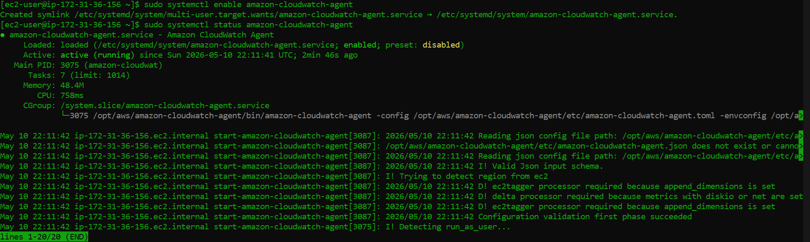

---

## Outcome

Successfully configured:
- CloudWatch Agent installation on EC2 instances  
- Custom metric collection for system monitoring  
- Enhanced infrastructure visibility  
- Monitoring coverage across development and production environments  

This phase established the foundation for advanced CloudWatch alarms, automated remediation workflows, and proactive cloud infrastructure monitoring.

---

# 3.4 Creating CloudWatch Alarms and SNS Notifications

## Introduction

In this phase of the project, I configured Amazon CloudWatch alarms and Amazon SNS notifications to detect performance issues and automatically send alerts when monitoring thresholds were exceeded.

This allows cloud support teams to respond quickly to infrastructure problems before they impact production systems.

The alarms created in this project monitor:
- High CPU utilization
- High disk usage
- Infrastructure performance anomalies

---

## Creating an SNS Topic

Created an Amazon SNS topic to receive CloudWatch alarm notifications.

### Steps Performed
1. Navigated to the Amazon SNS Console  
2. Selected **Topics**  
3. Clicked **Create topic**  
4. Selected **Standard Topic**  
5. Configured the topic name:
   - `cloudguard-alerts`

### Screenshot
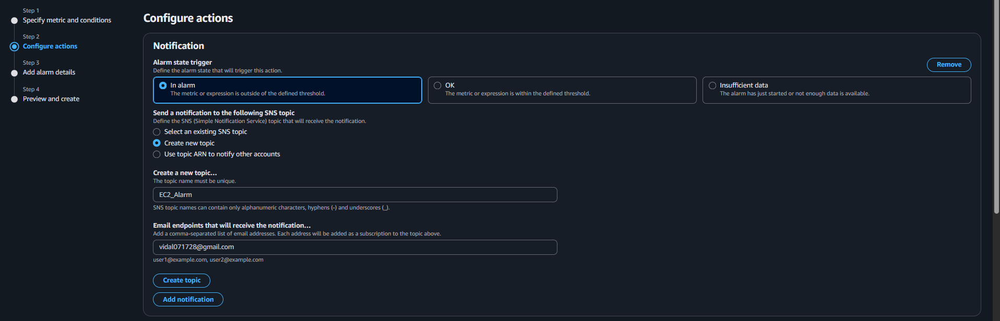

---

## Creating an Email Subscription

Configured an email subscription to receive alarm notifications from Amazon SNS.

### Steps Performed
1. Opened the SNS topic  
2. Clicked **Create subscription**  
3. Selected:
   - Protocol: `Email`
4. Entered an email endpoint for notifications  
5. Confirmed the subscription through the AWS confirmation email  

### Screenshot
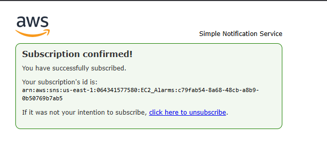

---

## Creating a High CPU Alarm

Created a CloudWatch alarm to monitor CPU utilization on the `Dev-Server` instance.

### Alarm Configuration

| Setting | Value |
|---|---|
| Metric | CPUUtilization |
| Threshold | Greater than 85% |
| Evaluation Period | 5 Minutes |
| Statistic | Average |
| Notification Target | cloudguard-alerts SNS Topic |

### Steps Performed
1. Opened Amazon CloudWatch  
2. Navigated to **Alarms**  
3. Selected **Create Alarm**  
4. Chose the `CPUUtilization` metric for the EC2 instance  
5. Configured threshold conditions  
6. Attached SNS notification actions  

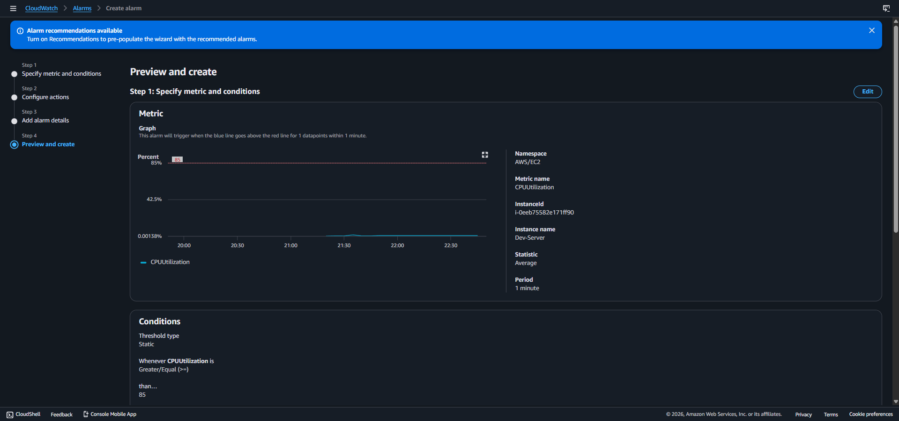

---
## Creating a Low Disk Space Alarm

Configured a CloudWatch alarm to monitor disk utilization on the `Prod-Server` instance using custom CloudWatch Agent metrics.

### Alarm Configuration

| Setting | Value |
|---|---|
| Namespace | CWAgent |
| Metric | disk_used_percent |
| Filesystem Path | `/` |
| Threshold | Greater than or Equal to 80% |
| Statistic | Average |
| Period | 1 Minute |

### Purpose

This alarm detects when disk utilization exceeds safe operational thresholds and triggers SNS notifications for rapid response.

---

## Creating the Lambda Function

Created a serverless AWS Lambda function to automatically respond to CloudWatch alarms triggered by infrastructure issues.

### Lambda Configuration

| Setting | Value |
|---|---|
| Function Name | EC2-AutoRemediation |
| Runtime | Python 3.14 |
| Architecture | x86_64 |
| Trigger Source | Amazon SNS |
| Purpose | Automated Incident Response |

### Steps Performed
1. Opened the AWS Lambda Console  
2. Selected **Create Function**  
3. Chose **Author from Scratch**  
4. Configured runtime and permissions  
5. Created the Lambda execution role  

### Screenshot
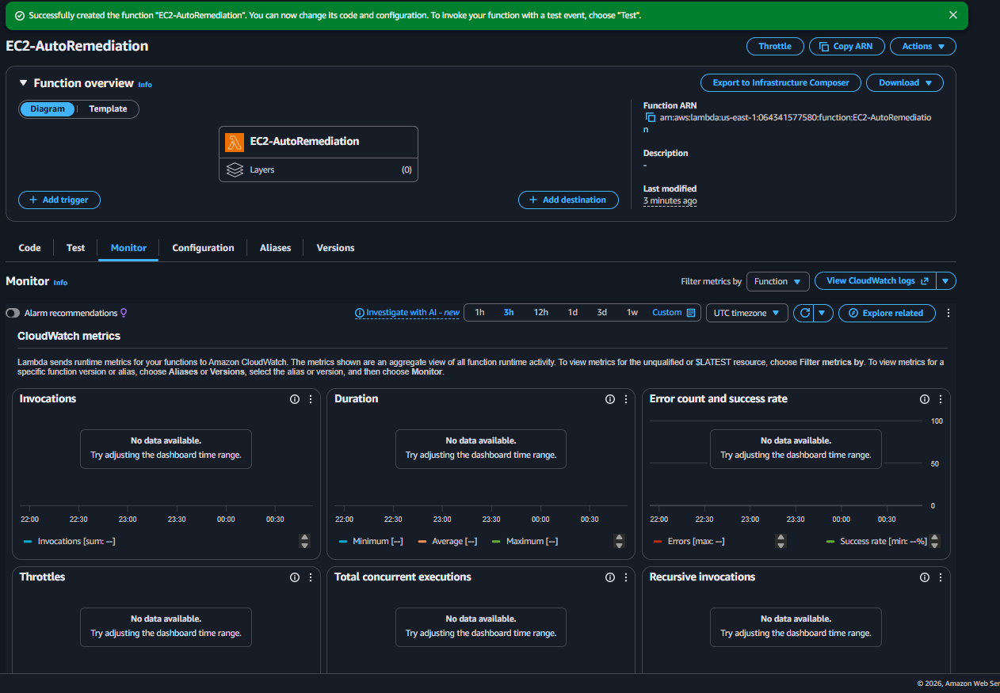

---

## Configuring Lambda Permissions

Attached IAM permissions required for the Lambda function to interact with EC2 resources and apply remediation tags.

### Permissions Added

| Permission | Purpose |
|---|---|
| AmazonEC2ReadOnlyAccess | Read EC2 instance details |
| ec2:CreateTags | Automatically tag affected instances |

### Inline Policy Created

```json
{
  "Version": "2012-10-17",
  "Statement": [
    {
      "Effect": "Allow",
      "Action": "ec2:CreateTags",
      "Resource": "arn:aws:ec2:*:*:instance/*"
    }
  ]
}
```

### Screenshot
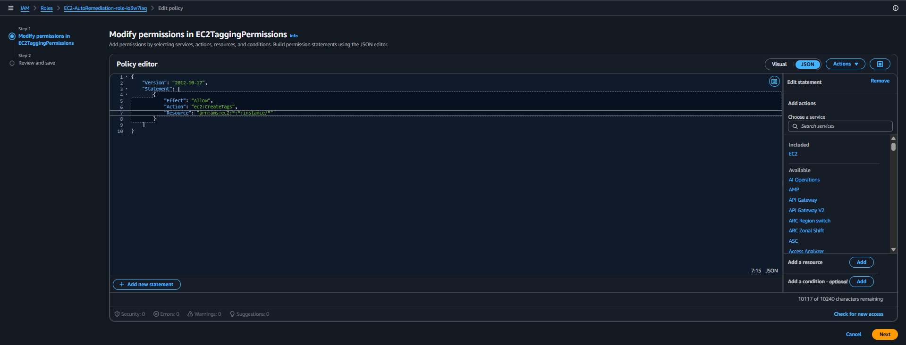

---

## Deploying the Auto-Remediation Code

Implemented Python-based remediation logic inside the Lambda function to process CloudWatch alarm events.

### What the Function Does

- Receives CloudWatch alarm notifications from SNS  
- Identifies the affected EC2 instance  
- Detects the issue type (`HighCPU` or `LowDisk`)  
- Automatically tags impacted instances  
- Logs remediation activity for monitoring and auditing  

### Technologies Used

- AWS Lambda  
- Amazon SNS  
- Amazon CloudWatch  
- Python (`boto3`)  

### Sample Lambda Logic

```python
if "HighCPU" in alarm_name:
    issue_tag = "HighCPU"
elif "LowDisk" in alarm_name:
    issue_tag = "LowDisk"

ec2.create_tags(
    Resources=[instance_id],
    Tags=[
        {
            'Key': 'Issue',
            'Value': issue_tag
        }
    ]
)
```

### Screenshot
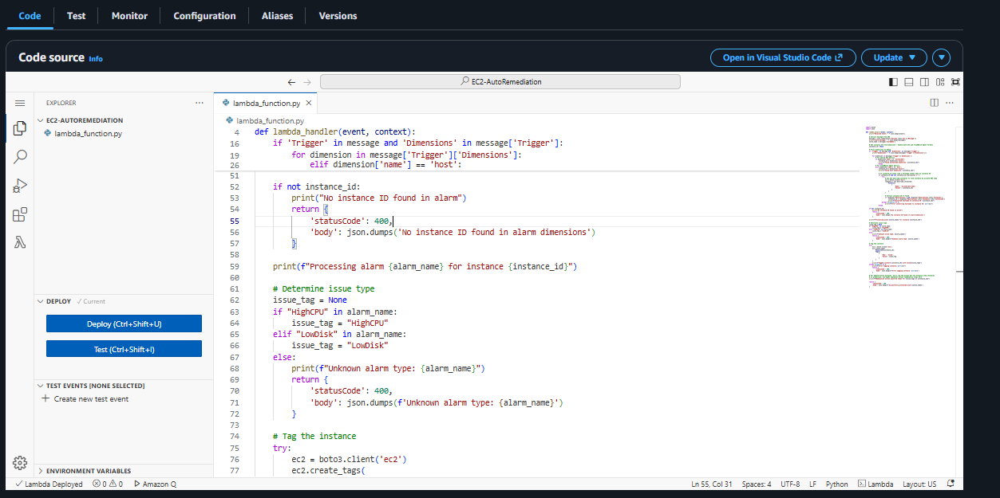

---

## Connecting Lambda to Amazon SNS

Integrated Amazon SNS with Lambda so CloudWatch alarms automatically trigger remediation workflows.

### SNS Subscription Configuration

| Setting | Value |
|---|---|
| Protocol | AWS Lambda |
| Endpoint | EC2-AutoRemediation |
| Notification Source | CloudWatch Alarms |

### Steps Performed
1. Opened the SNS Console  
2. Selected the `EC2-Alarms` topic  
3. Created a new subscription  
4. Selected **AWS Lambda** as the protocol  
5. Connected the `EC2-AutoRemediation` function  

### Screenshot
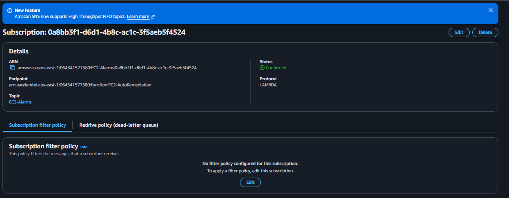

---

## Outcome

Successfully implemented an automated remediation workflow capable of:

- Detecting infrastructure issues in real time  
- Triggering Lambda functions from CloudWatch alarms  
- Automatically tagging impacted EC2 instances  
- Integrating monitoring, alerting, and remediation services  

This phase demonstrates practical experience with event-driven cloud automation and incident response workflows using AWS serverless technologies.

# 3.5 Introducing and Monitoring System Issues

## Introduction

In this section, controlled infrastructure issues were intentionally generated on both EC2 instances to validate the monitoring, alerting, notification, and automated remediation systems configured throughout the project.

The objective of this testing phase was to verify that:

- CloudWatch alarms correctly detect infrastructure problems  
- SNS notifications are delivered successfully  
- Lambda remediation workflows execute automatically  
- EC2 instances are tagged for issue tracking and visibility  
- Monitoring and alerting workflows function as expected in real-world scenarios  

This simulated how modern cloud monitoring systems respond to operational failures and performance degradation events.

---

# Triggering a High CPU Event

## Connecting to the Development Environment

Connected to the `Dev-Server` EC2 instance using SSH.

### Command Used

```bash
ssh -i "your-key.pem" ec2-user@your-dev-instance-ip
```

---

## Generating CPU Load

Used the `stress` utility to artificially increase CPU utilization and trigger the CloudWatch CPU alarm.

### Command Used

```bash
sudo stress --cpu 8 --timeout 300
```

### Purpose

This command launches 8 CPU-intensive worker processes for 5 minutes, generating enough load to exceed the configured 85% CPU utilization threshold.

### Screenshot
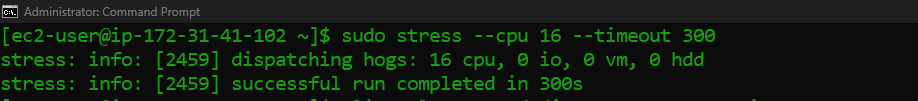

---

## Monitoring the Alarm Response

Observed the `DevInstance-HighCPU` CloudWatch alarm and monitored CPU utilization during testing.

### Verification Steps
1. Opened the AWS CloudWatch Console  
2. Navigated to **Alarms**  
3. Located the `DevInstance-HighCPU` alarm  
4. Monitored CPU utilization against the configured threshold  

### Screenshot
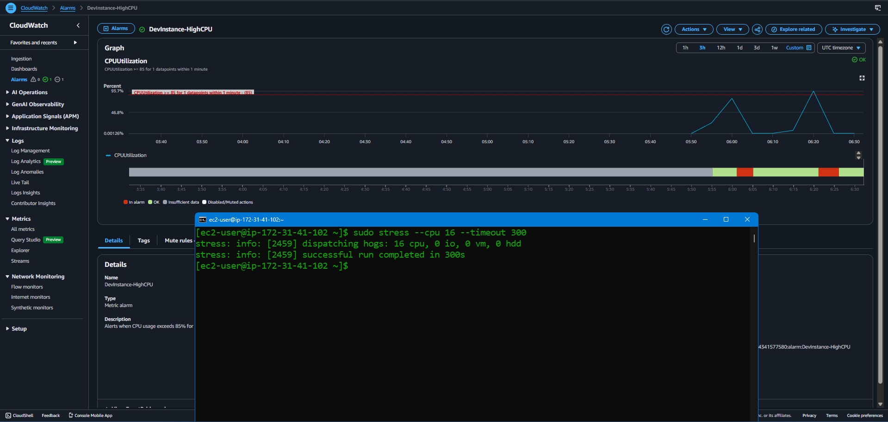

---

## Verifying SNS Notifications

Confirmed that SNS successfully delivered email notifications after the alarm threshold was exceeded.

### Screenshot
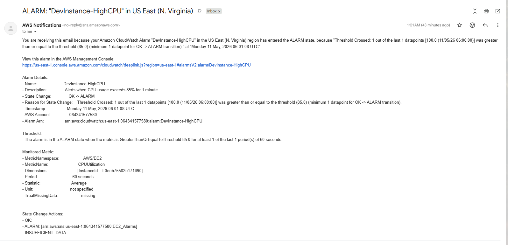

---

## Verifying Lambda Execution

Validated that the `EC2-AutoRemediation` Lambda function executed successfully after receiving the SNS notification.

### Screenshot
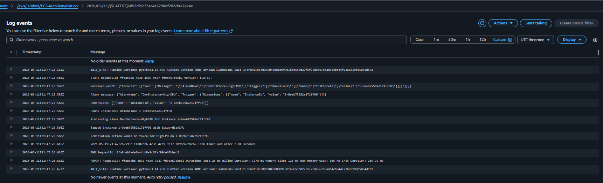

---
## Monitoring Lambda Execution

Verified that CloudWatch monitoring metrics populated successfully after executing the `EC2-AutoRemediation` Lambda function.

### Metrics Observed
- Lambda Invocations
- Execution Duration
- Concurrent Executions
- Success and Error Metrics

### Validation Results
- Lambda function executed successfully
- CloudWatch monitoring data populated correctly
- AWS Lambda metrics were captured in real time

### Screenshot
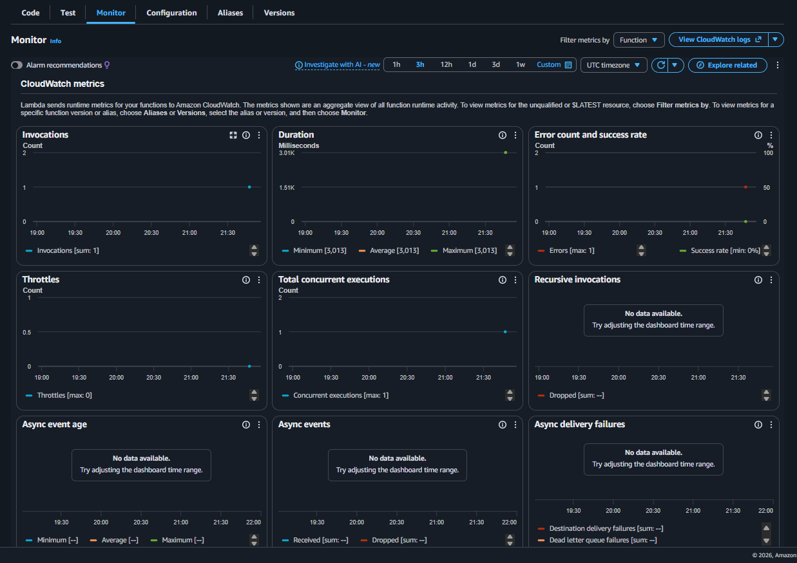

---

## Verifying Automatic EC2 Tagging

Confirmed that the Lambda function automatically tagged the affected EC2 instance.

| Key | Value |
|---|---|
| Issue | HighCPU |

### Screenshot
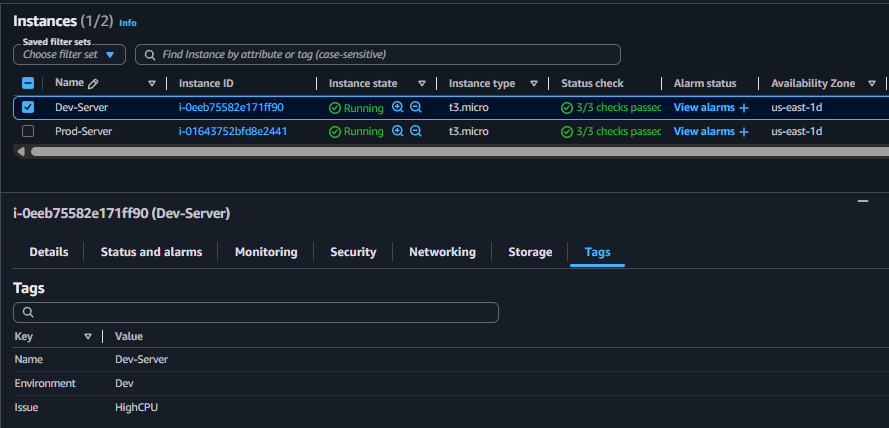

---

# Triggering a Low Disk Space Event

## Connecting to the Production Environment

Connected to the `Prod-Server` EC2 instance using SSH.

### Command Used

```bash
ssh -i "your-key.pem" ec2-user@your-prod-instance-ip
```

---

## Consuming Disk Space

Created a large file to intentionally increase disk utilization and trigger the CloudWatch disk usage alarm.

### Command Used

```bash
fallocate -l 6G /home/ec2-user/fakefile
```

### Screenshot
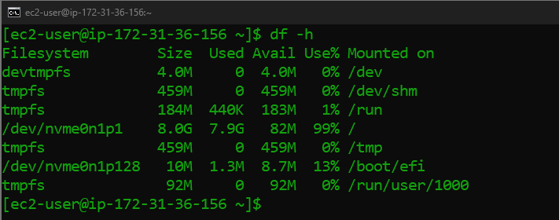

---

## Monitoring the Disk Alarm Response

Observed the `ProdInstance-LowDisk` CloudWatch alarm transition during testing.

### Verification Steps
1. Opened the AWS CloudWatch Console  
2. Navigated to **Alarms**  
3. Located the `ProdInstance-LowDisk` alarm  
4. Verified alarm activity and monitoring metrics  

### Screenshot
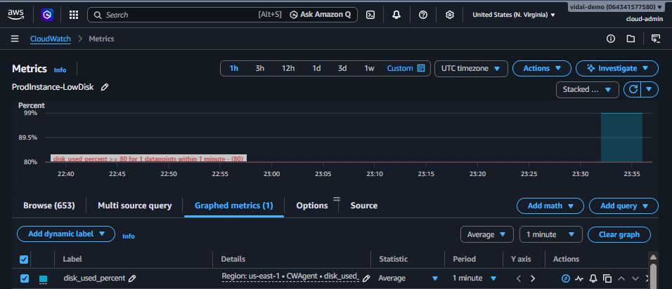

---

## Verifying SNS Notifications

Confirmed that SNS successfully delivered disk utilization alert notifications.

### Screenshot
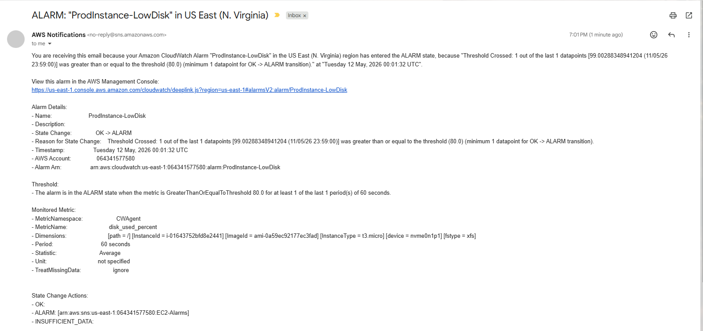

---

## Verifying Lambda Remediation

Validated that the Lambda remediation function successfully processed the low disk alarm and tagged the affected EC2 instance.

| Key | Value |
|---|---|
| Issue | LowDisk |

### Screenshot
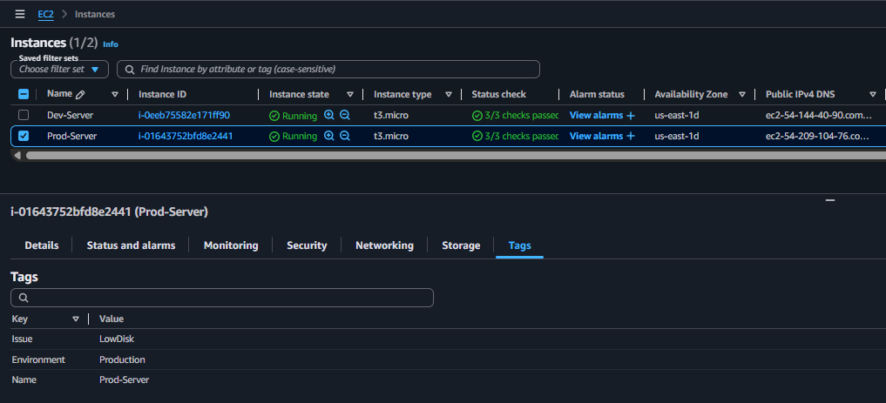

---

# Cleaning Up After Testing

## Removing the Test File

Deleted the temporary file created during testing to reclaim disk space and restore normal operating conditions.

### Command Used

```bash
sudo rm /home/ec2-user/fakefile
```

### Result

Once the file was removed:
- Disk utilization returned to normal levels  
- CloudWatch metrics stabilized  
- The disk usage alarm gradually returned to the `OK` state  

### Screenshot
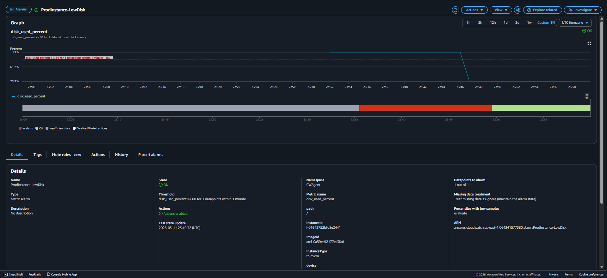

---

## Stopping the CPU Stress Test

If the stress test was still running, it was manually stopped using:

```bash
Ctrl + C
```

Otherwise, the workload automatically terminated after the configured timeout period.

---

# What Was Learned

By intentionally triggering controlled infrastructure events, the monitoring and remediation pipeline was successfully validated.

## Successfully Verified

- CloudWatch alarms detected abnormal system behavior  
- SNS notifications were delivered successfully  
- Lambda remediation workflows executed automatically  
- EC2 instances were tagged appropriately for issue tracking  
- Monitoring visibility and operational awareness improved significantly  

## Final Result

This implementation demonstrated a proactive cloud monitoring and incident response workflow capable of:
- Detecting infrastructure problems in real time  
- Alerting administrators immediately  
- Automating remediation workflows  
- Tracking incidents across EC2 resources  

This project successfully simulated how modern cloud environments use monitoring, alerting, automation, and infrastructure tagging to improve operational resilience and response capabilities.

---

# 3.6 Setting Up AWS GuardDuty and Simulating Security Threats

## Introduction

In this section, AWS GuardDuty was enabled to enhance CloudGuard’s security monitoring and threat detection capabilities. A simulated reconnaissance attack was then performed using `nmap` to validate that GuardDuty successfully detects suspicious activity within the AWS environment.

---

# Enabling AWS GuardDuty

## Accessing the GuardDuty Console

Navigated to the AWS GuardDuty console and selected:

```text
Get Started
```

Reviewed the required IAM service permissions used by GuardDuty to monitor:
- CloudTrail logs
- VPC Flow Logs
- DNS query logs

Enabled GuardDuty for the `us-east-1` region.

### Screenshot 
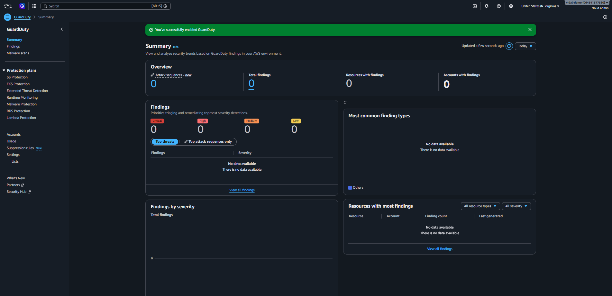

Recommended Screenshot:
- GuardDuty dashboard after enabling the service
- “GuardDuty enabled successfully” visible

---

# Reviewing GuardDuty IAM Permissions

Reviewed the IAM permissions required for GuardDuty to monitor AWS resources and security events.

These permissions included:
- EC2 Describe permissions
- S3 visibility permissions
- Organization account visibility permissions
- VPC monitoring permissions

### Screenshot Required
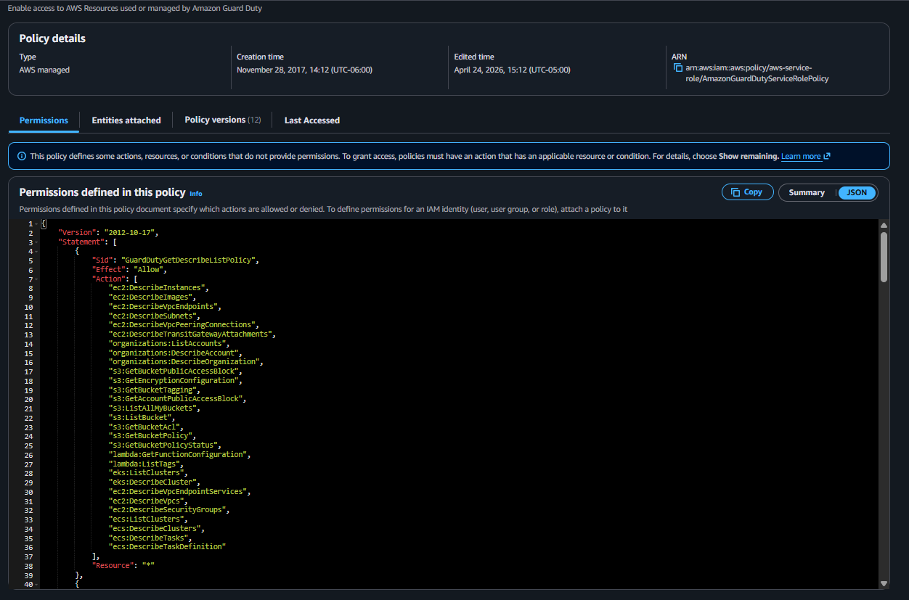

---

# Configuring AWS CLI Credentials

Configured AWS CLI credentials on the Dev EC2 instance using:

```bash
aws configure
```

Provided:
- AWS Access Key ID
- AWS Secret Access Key
- Default region: `us-east-1`
- Output format: `json`

> **Security Note:** IAM roles should be used in production environments instead of long-term access keys whenever possible.

### Screenshot 
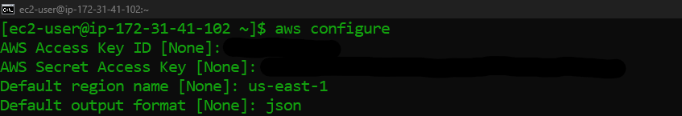


---

# Installing Nmap

Installed the `nmap` network scanning utility on both EC2 instances.

### Command Used

```bash
sudo yum install nmap -y
```

### Screenshot 
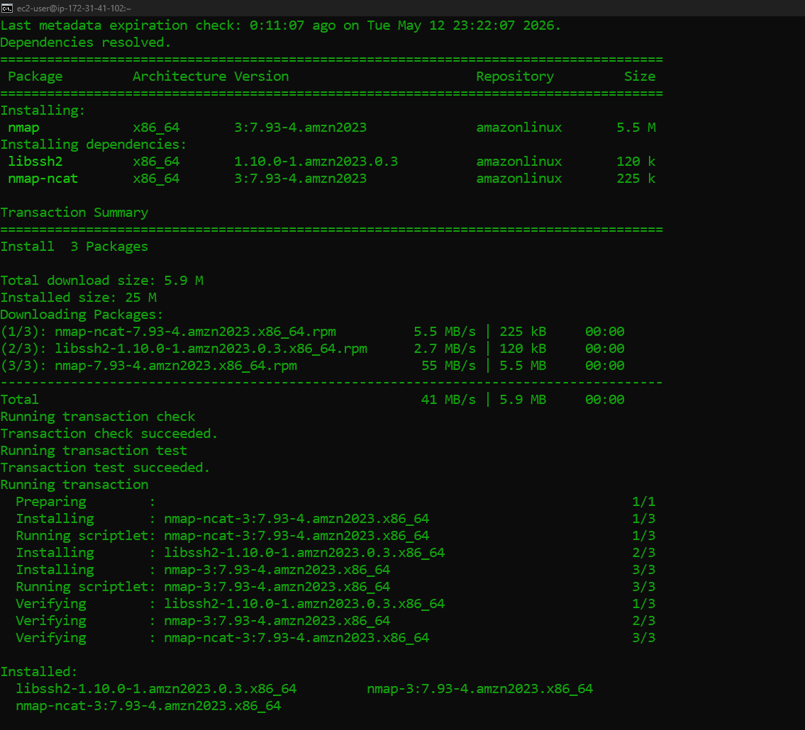


---

# Simulating a Security Threat

## Performing an Aggressive Port Scan

From the Dev EC2 instance, performed an aggressive network scan against the Prod EC2 instance to simulate attacker reconnaissance behavior.

### Command Used

```bash
sudo nmap -Pn -p 1-1000 -T4 -A [TARGET-EC2-IP]
```

### Parameter Breakdown

| Parameter | Description |
|---|---|
| `-Pn` | Skip host discovery |
| `-p 1-1000` | Scan ports 1–1000 |
| `-T4` | Aggressive timing template |
| `-A` | Enable OS detection and advanced scanning |

### Screenshot 
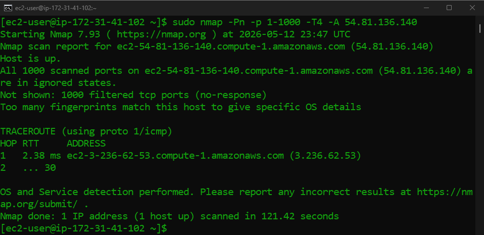

---

# Observing GuardDuty Findings

## Reviewing Threat Detection Results

After approximately 30–60 minutes, GuardDuty detected suspicious reconnaissance activity generated by the `nmap` scan.

Navigated to:

```text
GuardDuty → Findings
```

Reviewed findings related to:

```text
PortProbe
```

The findings included:
- Severity level
- Affected EC2 instance
- Source IP information
- Remediation recommendations

### Screenshot
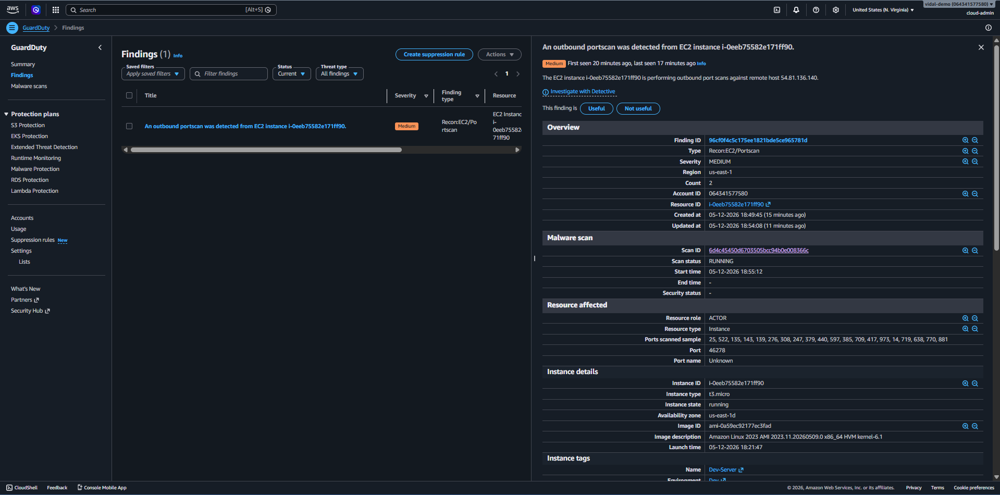

---

# What I've Learned

By completing this section, the following security capabilities were successfully validated:
- AWS GuardDuty was enabled successfully
- Continuous threat monitoring was activated
- Simulated reconnaissance activity was detected
- GuardDuty findings generated actionable security intelligence
- CloudGuard gained proactive cloud threat detection visibility

This implementation demonstrates how AWS-native threat detection services can identify suspicious activity and improve cloud security monitoring within AWS environments.

---

# 3.7 Cloud Engineer Incident Response: Handling the GuardDuty Finding

## Introduction

After configuring AWS GuardDuty and generating a simulated reconnaissance attack, the next phase focused on incident response procedures. This section demonstrates how CloudGuard investigated, analyzed, and remediated a detected security event using AWS-native security controls. :contentReference[oaicite:0]{index=0}

---

# Analyzing the GuardDuty Finding

## Reviewing Threat Detection Details

Navigated to:

```text
GuardDuty → Findings
```

Located the GuardDuty finding related to the simulated `nmap` reconnaissance scan and reviewed the detailed threat intelligence provided by AWS GuardDuty.

### Findings Reviewed

| Attribute | Details |
|---|---|
| Finding Type | `Recon:EC2/PortProbeUnprotectedPort` |
| Severity | Medium |
| Source | 100.54.197.113 |
| Target | 54.81.136.140 |
| Activity | Port Scanning |
| Ports Scanned | 1–1000 |

### Screenshot Required
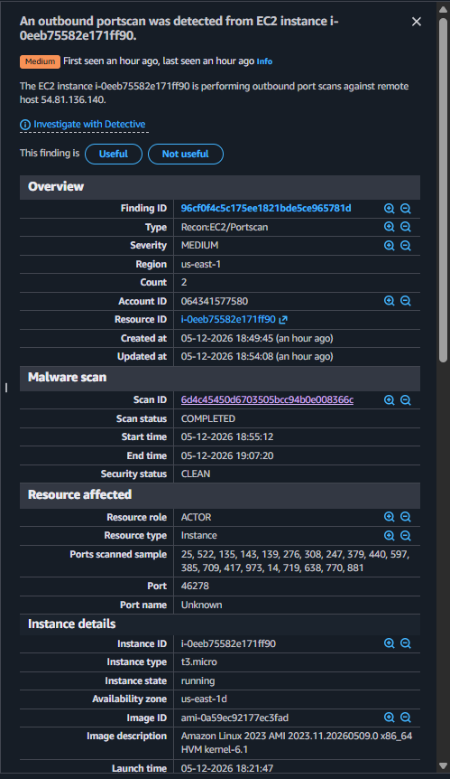

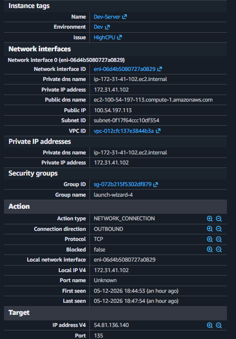

---

# Investigating the Root Cause

## Reviewing System Logs

Investigated system activity on the Production EC2 instance to identify evidence of reconnaissance behavior and validate the source of the scan. :contentReference[oaicite:1]{index=1}

### Commands Used

```bash
# Search for nmap-related activity
sudo journalctl | grep -i "nmap"
```

### Investigation Results

- Verified the scan originated from the Dev EC2 instance
- Confirmed the activity was part of controlled security testing
- Validated no unauthorized exploitation occurred

### Screenshot Required
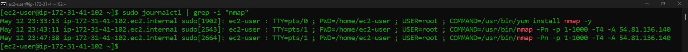

---

# Reviewing Security Configurations

## Validating Security Group Exposure

Reviewed EC2 Security Group configurations to verify that only authorized network access was permitted within the CloudGuard environment.

### Validation Results

- Confirmed only SSH port `22` was exposed
- Verified access was restricted to a trusted IP address
- Confirmed no unnecessary ports were publicly accessible
- Validated that the reconnaissance scan did not exploit misconfigured Security Group rules

### Screenshot
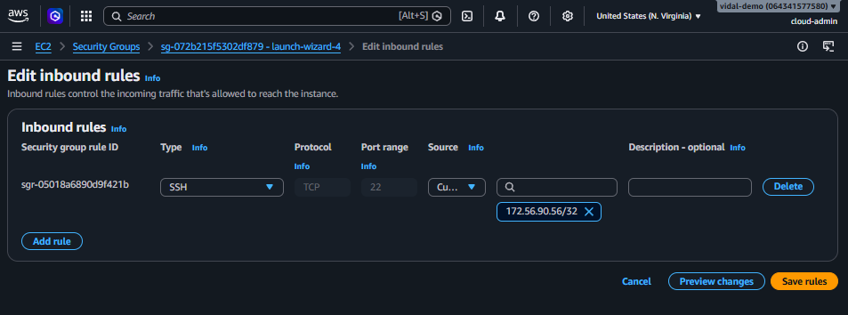

---

# Implementing Remediation Actions

## Creating a Network ACL

Implemented an additional network security layer using a Network Access Control List (NACL) to block suspicious scanning activity between environments. :contentReference[oaicite:3]{index=3}

### NACL Configuration

| Rule # | Type | Action | Source |
|---|---|---|---|
| 100 | TCP 1-1000 | DENY | Dev EC2 IP |
| 200 | ALL Traffic | ALLOW | 0.0.0.0/0 |

### Steps Performed

1. Navigated to:
   ```text
   VPC → Network ACLs
   ```

2. Created:
   ```text
   CloudGuard-Prod-Protection-NACL
   ```

3. Added inbound deny rule for suspicious port scanning activity

4. Associated the NACL with the Production subnet

### Screenshot Required

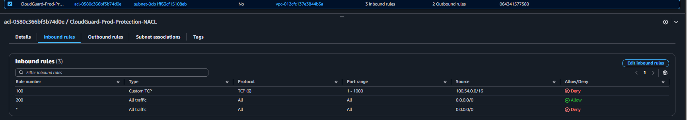

---

# Validating the Remediation

## Retesting the Port Scan

After implementing the NACL rule, performed another `nmap` scan against the Production EC2 instance to validate the remediation controls. :contentReference[oaicite:4]{index=4}

### Command Used

```bash
sudo nmap -p 1-1000 -T4 -A 54.81.136.140
```

### Validation Results

- Port scanning activity was restricted
- NACL remediation controls functioned correctly
- Defense-in-depth protections were successfully implemented

### Screenshot Required
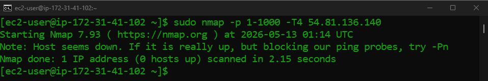

---

# Creating an Incident Report
```md
## Documenting the Security Event

Created a formal incident report documenting the detection, investigation, remediation, and lessons learned from the GuardDuty finding.

### Incident Summary

| Category | Details |
|---|---|
| Incident Type | Port Scanning Activity |
| Severity | Medium |
| Detection Source | AWS GuardDuty |
| Root Cause | Controlled Security Testing |
| Business Impact | None |

### Key Actions Taken

- Investigated GuardDuty findings
- Reviewed Production system logs
- Implemented NACL protections
- Validated remediation effectiveness
- Documented incident response actions

## Documenting the Security Event

A formal security incident report was created to document the GuardDuty finding, investigation process, remediation actions, and security recommendations following the simulated reconnaissance activity between the Development and Production environments.

---

# CloudGuard Security Incident Report

## Incident Overview

| Category | Details |
|---|---|
| **Incident ID** | SEC-2025-2025-05-11-001 |
| **Incident Type** | Internal Reconnaissance / Port Scanning |
| **Severity** | Medium |
| **Detection Source** | AWS GuardDuty |
| **Source Environment** | Development EC2 Instance |
| **Target Environment** | Production EC2 Instance |
| **Source IP Address** | `100.54.197.113` |
| **Target IP Address** | `54.81.136.140` |

---

## Incident Description

AWS GuardDuty detected suspicious reconnaissance activity originating from the Development EC2 instance targeting the Production EC2 environment. The activity matched behavioral patterns commonly associated with attacker reconnaissance techniques and was identified as aggressive port scanning activity using the `nmap` utility.

The security event was intentionally generated as part of controlled CloudGuard security testing to validate GuardDuty threat detection and incident response capabilities.

---

## Timeline of Events

| Time (UTC) | Event |
|---|---|
| **23:31** | Initiated `nmap` reconnaissance scan from Development environment |
| **23:35** | AWS GuardDuty generated a `PortProbe` finding |
| **23:38** | Investigation confirmed the Development instance as the source |
| **23:42** | Reviewed EC2 Security Group exposure and access controls |
| **23:47** | Implemented Network ACL remediation controls |
| **23:52** | Performed remediation validation testing |

---

## Root Cause Analysis

The incident originated from a controlled security assessment performed without formalized change management procedures or documented authorization workflows for internal security testing activities.

No unauthorized compromise or exploitation occurred during the event.

---

## Investigation and Response Actions

The following incident response actions were completed:

- Verified GuardDuty finding details and severity classification
- Investigated EC2 system logs for evidence of reconnaissance activity
- Confirmed execution of the `nmap` scan command from the Development instance
- Reviewed Security Group configurations for excessive exposure
- Implemented Network ACL protections between Development and Production environments
- Conducted remediation validation testing
- Documented findings and security recommendations

## Business Impact Assessment:

No business impact occurred during this event.

The reconnaissance activity was:
- detected successfully,
- investigated promptly,
- and remediated before any exploitation attempt could occur.

No data exposure, service interruption, or unauthorized access was identified.

## Security Recommendations:

To strengthen CloudGuard’s long-term cloud security posture, the following recommendations were identified:

- Implement formal approval and change management procedures for internal security testing
- Enhance network segmentation between Development and Production environments
- Create automated remediation workflows using AWS Lambda and EventBridge
- Configure CloudWatch notifications for future GuardDuty findings
- Perform recurring cloud security posture assessments
- Develop standardized incident response runbooks and escalation procedures


## Conclusion

This exercise successfully demonstrated the full cloud security incident response lifecycle within AWS, including:

- Threat detection using AWS GuardDuty
- Security investigation using EC2 system logs
- Validation of reconnaissance activity
- Network remediation using NACL controls
- Security documentation and reporting
- Defense-in-depth cloud security practices

By completing this exercise, CloudGuard validated its ability to detect, investigate, and respond to suspicious cloud activity using AWS-native security services.

```
---

# Implementing Preventive Measures

## Strengthening Cloud Security Posture

Outlined additional security improvements to enhance CloudGuard’s long-term cloud security maturity. :contentReference[oaicite:6]{index=6}

### Security Enhancements

- Automate GuardDuty remediation with EventBridge and Lambda
- Implement AWS Config security auditing
- Strengthen Dev/Prod network segmentation
- Establish formal security testing procedures
- Integrate AWS Security Hub
- Create standardized incident response runbooks

---

# Key Takeaways

This exercise demonstrated the complete AWS cloud incident response lifecycle:

- Threat detection using AWS GuardDuty
- Security investigation using system logs
- Network remediation using NACLs
- Validation of defensive controls
- Security documentation and reporting
- Defense-in-depth cloud security architecture

By implementing these procedures, CloudGuard strengthened its operational security capabilities and demonstrated proactive cloud threat response practices. 
